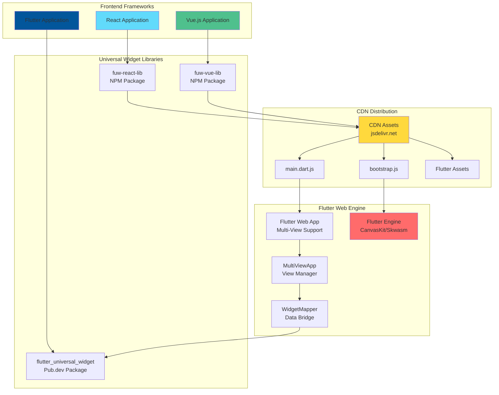
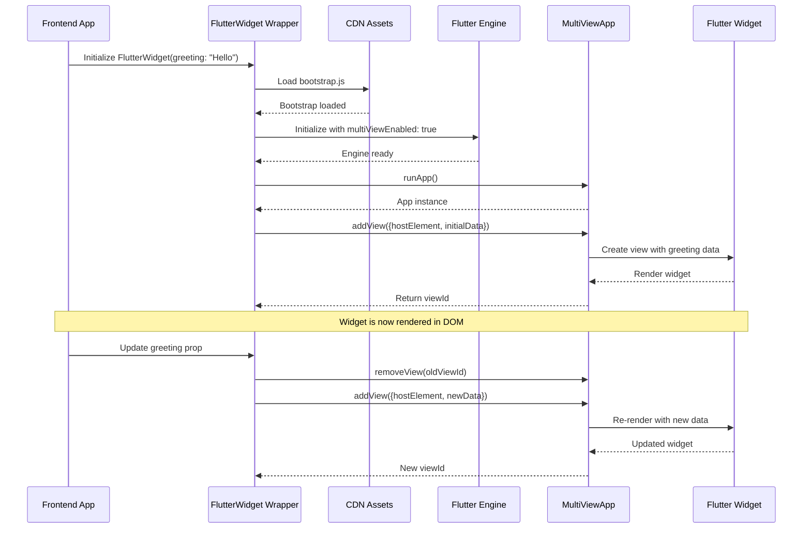
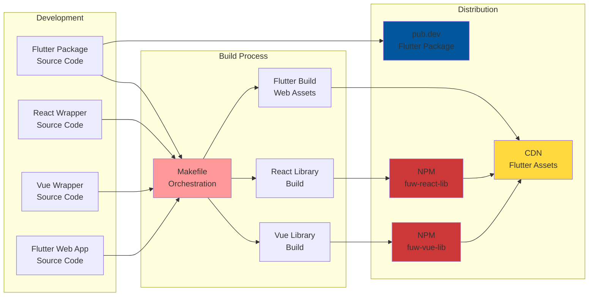

# Flutter Universal Widget

A revolutionary cross-platform widget system that enables Flutter widgets to be seamlessly integrated into React, Vue.js, and Flutter applications. This project provides a universal abstraction layer that allows developers to write Flutter widgets once and use them across multiple frontend frameworks.

## Table of Contents

- [Architecture Overview](#architecture-overview)
- [Usage Instructions](#usage-instructions)
  - [React Integration](#react-integration)
  - [Vue.js Integration](#vuejs-integration)
  - [Flutter Integration](#flutter-integration)
- [Build and Publish Process](#build-and-publish-process)
- [Development Guide](#development-guide)
- [Contribution Guidelines](#contribution-guidelines)
- [Troubleshooting](#troubleshooting)
- [License](#license)

## Architecture Overview

The Flutter Universal Widget system is built on a multi-layered architecture that enables Flutter widgets to run in web environments through a sophisticated abstraction layer.

### System Architecture



### Component Hierarchy and Data Flow



### Key Components

#### 1. Universal Widget Abstraction Layer
- **Flutter Package** (`flutter_universal_widget`): Core Flutter widget definitions
- **React Wrapper** (`fuw-react-lib`): React component that embeds Flutter widgets
- **Vue Wrapper** (`fuw-vue-lib`): Vue.js component that embeds Flutter widgets

#### 2. Multi-View Flutter Engine
- **MultiViewApp**: Manages multiple Flutter widget instances in a single Flutter app
- **WidgetMapper**: Bridges data between JavaScript and Dart environments
- **View Management**: Handles creation, updates, and disposal of widget views

#### 3. CDN Distribution System
- **Bootstrap Loading**: Dynamic loading of Flutter engine assets
- **Asset Management**: Efficient delivery of Flutter web assets via CDN
- **Version Management**: Automatic version resolution for package assets

## Usage Instructions

The Flutter Universal Widget system provides seamless integration across React, Vue.js, and Flutter applications. Each platform has its own wrapper library that handles the complexity of embedding Flutter widgets.

### React Integration

#### Installation

```bash
npm install fuw-react-lib
# or
yarn add fuw-react-lib
# or
pnpm add fuw-react-lib
```

#### Basic Usage

```tsx
import React from 'react';
import FlutterWidget from 'fuw-react-lib';

function App() {
  return (
    <div className="app">
      <h1>My React App</h1>
      <FlutterWidget
        greeting="Hello from React!"
        height={400}
        className="my-flutter-widget"
        style={{ border: '1px solid #ccc' }}
      />
    </div>
  );
}

export default App;
```

#### Advanced Configuration

```tsx
import React, { useState } from 'react';
import FlutterWidget, { FlutterWidgetProps } from 'fuw-react-lib';

function AdvancedExample() {
  const [greeting, setGreeting] = useState('Hello World!');

  const widgetProps: FlutterWidgetProps = {
    greeting,
    height: 500,
    renderer: 'canvaskit', // or 'skwasm'
    className: 'custom-flutter-widget',
    style: {
      borderRadius: '8px',
      boxShadow: '0 4px 6px rgba(0, 0, 0, 0.1)'
    }
  };

  return (
    <div>
      <input
        value={greeting}
        onChange={(e) => setGreeting(e.target.value)}
        placeholder="Enter greeting"
      />
      <FlutterWidget {...widgetProps} />
    </div>
  );
}
```

#### TypeScript Support

The React library includes full TypeScript definitions:

```tsx
export interface FlutterWidgetProps {
  greeting: string;
  height?: number;
  className?: string;
  style?: React.CSSProperties;
  assetBase?: string;
  renderer?: "skwasm" | "canvaskit";
}
```

### Vue.js Integration

#### Installation

```bash
npm install fuw-vue-lib
# or
yarn add fuw-vue-lib
# or
pnpm add fuw-vue-lib
```

#### Basic Usage

```vue
<template>
  <div class="app">
    <h1>My Vue.js App</h1>
    <FlutterWidget
      :greeting="greeting"
      :height="400"
      class="my-flutter-widget"
      :style="{ border: '1px solid #ccc' }"
    />
  </div>
</template>

<script setup lang="ts">
import { ref } from 'vue';
import { FlutterWidget } from 'fuw-vue-lib';

const greeting = ref('Hello from Vue.js!');
</script>
```

#### Composition API Example

```vue
<template>
  <div>
    <input
      v-model="greeting"
      placeholder="Enter greeting"
    />
    <FlutterWidget
      :greeting="greeting"
      :height="height"
      :renderer="renderer"
      class="custom-flutter-widget"
      :style="widgetStyle"
    />
  </div>
</template>

<script setup lang="ts">
import { ref, computed } from 'vue';
import { FlutterWidget } from 'fuw-vue-lib';

const greeting = ref('Hello World!');
const height = ref(500);
const renderer = ref<'canvaskit' | 'skwasm'>('canvaskit');

const widgetStyle = computed(() => ({
  borderRadius: '8px',
  boxShadow: '0 4px 6px rgba(0, 0, 0, 0.1)'
}));
</script>
```

#### Options API Example

```vue
<template>
  <div>
    <FlutterWidget
      :greeting="greeting"
      :height="400"
      renderer="canvaskit"
    />
  </div>
</template>

<script lang="ts">
import { defineComponent } from 'vue';
import { FlutterWidget } from 'fuw-vue-lib';

export default defineComponent({
  components: {
    FlutterWidget
  },
  data() {
    return {
      greeting: 'Hello from Vue Options API!'
    };
  }
});
</script>
```

### Flutter Integration

#### Installation

Add the package to your `pubspec.yaml`:

```yaml
dependencies:
  flutter_universal_widget: ^0.0.1
```

Then run:

```bash
flutter pub get
```

#### Basic Usage

```dart
import 'package:flutter/material.dart';
import 'package:flutter_universal_widget/flutter_universal_widget.dart';

class MyApp extends StatelessWidget {
  @override
  Widget build(BuildContext context) {
    return MaterialApp(
      home: Scaffold(
        appBar: AppBar(title: Text('Flutter Universal Widget')),
        body: Center(
          child: FlutterWidget(
            greeting: 'Hello from Flutter!',
          ),
        ),
      ),
    );
  }
}
```

#### Custom Widget Implementation

```dart
import 'package:flutter/material.dart';
import 'package:flutter_universal_widget/flutter_universal_widget.dart';

class CustomFlutterWidget extends StatelessWidget {
  final String greeting;
  final Color? backgroundColor;
  final TextStyle? textStyle;

  const CustomFlutterWidget({
    Key? key,
    required this.greeting,
    this.backgroundColor,
    this.textStyle,
  }) : super(key: key);

  @override
  Widget build(BuildContext context) {
    return Container(
      padding: EdgeInsets.all(16),
      decoration: BoxDecoration(
        color: backgroundColor ?? Colors.blue.shade100,
        borderRadius: BorderRadius.circular(8),
        boxShadow: [
          BoxShadow(
            color: Colors.black.withOpacity(0.1),
            blurRadius: 4,
            offset: Offset(0, 2),
          ),
        ],
      ),
      child: Text(
        greeting,
        style: textStyle ?? TextStyle(
          fontSize: 18,
          fontWeight: FontWeight.bold,
          color: Colors.blue.shade800,
        ),
        textAlign: TextAlign.center,
      ),
    );
  }
}
```

#### Integration with State Management

```dart
import 'package:flutter/material.dart';
import 'package:flutter_universal_widget/flutter_universal_widget.dart';
import 'package:provider/provider.dart';

class GreetingProvider extends ChangeNotifier {
  String _greeting = 'Hello World!';

  String get greeting => _greeting;

  void updateGreeting(String newGreeting) {
    _greeting = newGreeting;
    notifyListeners();
  }
}

class StatefulFlutterWidget extends StatelessWidget {
  @override
  Widget build(BuildContext context) {
    return ChangeNotifierProvider(
      create: (_) => GreetingProvider(),
      child: Consumer<GreetingProvider>(
        builder: (context, provider, child) {
          return Column(
            children: [
              TextField(
                onChanged: provider.updateGreeting,
                decoration: InputDecoration(
                  labelText: 'Enter greeting',
                ),
              ),
              SizedBox(height: 16),
              FlutterWidget(greeting: provider.greeting),
            ],
          );
        },
      ),
    );
  }
}
```

### Configuration Options

All platform wrappers support the following configuration options:

| Property | Type | Default | Description |
|----------|------|---------|-------------|
| `greeting` | `string` | Required | The text to display in the widget |
| `height` | `number` | `420` | Height of the widget container in pixels |
| `renderer` | `'canvaskit' \| 'skwasm'` | `'canvaskit'` | Flutter web renderer to use |
| `assetBase` | `string` | CDN URL | Custom base URL for Flutter assets |
| `className` | `string` | `undefined` | CSS class for styling (React only) |
| `class` | `string` | `undefined` | CSS class for styling (Vue only) |
| `style` | `object` | `{}` | Inline styles for the container |

## Build and Publish Process

The Flutter Universal Widget system uses a sophisticated build pipeline that coordinates the compilation and distribution of Flutter, React, and Vue.js components.

### Build Pipeline Architecture



### Local Development Build

#### Prerequisites

- Flutter SDK (>=3.9.0)
- Node.js (>=18.12.0)
- pnpm (recommended) or npm/yarn

#### Build All Components

```bash
# Clean and build all components
make build
```

This command performs the following steps:

1. **Clean**: Removes all build artifacts and dependencies
2. **Flutter Analysis**: Runs `flutter analyze` on the Flutter package
3. **Flutter Tests**: Executes `flutter test` in the package directory
4. **Flutter Web Build**: Compiles the Flutter web app with debug symbols
5. **React Library Build**: Builds the React wrapper using Rslib
6. **Vue Library Build**: Builds the Vue.js wrapper using Rslib

#### Individual Component Builds

```bash
# Build only Flutter package
cd package && flutter test

# Build only React library
cd web/react-lib && pnpm build

# Build only Vue library
cd web/vue-lib && pnpm build

# Build only Flutter web app
cd web/_flutter && flutter build web --debug --pwa-strategy=none
```

### Publishing to NPM

#### React Library (`fuw-react-lib`)

1. **Update Version**:
   ```bash
   cd web/react-lib
   npm version patch|minor|major
   ```

2. **Build and Test**:
   ```bash
   pnpm build
   pnpm check  # Run linting and formatting
   ```

3. **Publish**:
   ```bash
   npm publish
   ```

#### Vue Library (`fuw-vue-lib`)

1. **Update Version**:
   ```bash
   cd web/vue-lib
   npm version patch|minor|major
   ```

2. **Build and Test**:
   ```bash
   pnpm build
   pnpm check  # Run linting and formatting
   ```

3. **Publish**:
   ```bash
   npm publish
   ```

### Publishing to pub.dev

#### Flutter Package (`flutter_universal_widget`)

1. **Update Version**:
   ```yaml
   # In package/pubspec.yaml
   version: 0.0.2  # Increment version
   ```

2. **Validate Package**:
   ```bash
   cd package
   flutter pub publish --dry-run
   ```

3. **Publish**:
   ```bash
   flutter pub publish
   ```

### Version Management and Release Workflow

#### Semantic Versioning

This project follows [Semantic Versioning](https://semver.org/):

- **MAJOR**: Breaking changes to the API
- **MINOR**: New features that are backward compatible
- **PATCH**: Bug fixes and minor improvements

#### Release Checklist

1. **Update all package versions** consistently across:
   - `package/pubspec.yaml` (Flutter package)
   - `web/react-lib/package.json` (React library)
   - `web/vue-lib/package.json` (Vue library)

2. **Run full build and tests**:
   ```bash
   make build
   ```

3. **Update documentation** if needed

4. **Create release commit**:
   ```bash
   git add .
   git commit -m "release: v1.0.0"
   git tag v1.0.0
   git push origin main --tags
   ```

5. **Publish packages** in order:
   - Flutter package to pub.dev
   - React library to NPM
   - Vue library to NPM

### CI/CD Pipeline

The project uses GitHub Actions for automated testing and deployment:

```yaml
# .github/workflows/ci.yml
name: CI/CD Pipeline

on:
  push:
    branches: [ main ]
  pull_request:
    branches: [ main ]

jobs:
  test:
    runs-on: ubuntu-latest
    steps:
      - uses: actions/checkout@v3
      - uses: subosito/flutter-action@v2
      - uses: actions/setup-node@v3
        with:
          node-version: '18'
      - run: make build

  publish:
    needs: test
    runs-on: ubuntu-latest
    if: startsWith(github.ref, 'refs/tags/')
    steps:
      - name: Publish to NPM
        run: |
          cd web/react-lib && npm publish
          cd web/vue-lib && npm publish
      - name: Publish to pub.dev
        run: cd package && flutter pub publish --force
```

## Development Guide

This section provides comprehensive guidance for developers who want to contribute to or extend the Flutter Universal Widget system.

### Repository Structure

```
flutter_universal_widget/
├── package/                    # Flutter package source
│   ├── lib/
│   │   ├── flutter_universal_widget.dart
│   │   └── src/
│   │       └── flutter_widget.dart
│   ├── test/
│   └── pubspec.yaml
├── web/
│   ├── _flutter/              # Flutter web application
│   │   ├── lib/
│   │   │   ├── main.dart
│   │   │   ├── multi_view_app.dart
│   │   │   └── src/
│   │   │       └── widget_view.dart
│   │   └── pubspec.yaml
│   ├── react-lib/             # React wrapper library
│   │   ├── src/
│   │   │   └── index.tsx
│   │   ├── package.json
│   │   └── rslib.config.ts
│   └── vue-lib/               # Vue.js wrapper library
│       ├── src/
│       │   ├── FlutterWidget.vue
│       │   └── index.ts
│       ├── package.json
│       └── rslib.config.ts
├── demos/
│   └── react-example/         # React demo application
├── Makefile                   # Build orchestration
└── pubspec.yaml              # Workspace configuration
```

### Setting Up Development Environment

#### 1. Fork and Clone Repository

```bash
git clone https://github.com/your-username/flutter_universal_widget.git
cd flutter_universal_widget
```

#### 2. Install Dependencies

```bash
# Install Flutter dependencies
flutter pub get

# Install Node.js dependencies for React library
cd web/react-lib
pnpm install

# Install Node.js dependencies for Vue library
cd ../vue-lib
pnpm install

# Install dependencies for React demo
cd ../../demos/react-example
pnpm install
```

#### 3. Verify Setup

```bash
# Run full build to verify everything works
make build
```

### Creating Custom Widgets

#### Flutter Widget Template

```dart
// package/lib/src/my_custom_widget.dart
import 'package:flutter/material.dart';

class MyCustomWidget extends StatelessWidget {
  final String title;
  final String description;
  final VoidCallback? onTap;

  const MyCustomWidget({
    Key? key,
    required this.title,
    required this.description,
    this.onTap,
  }) : super(key: key);

  @override
  Widget build(BuildContext context) {
    return Card(
      child: InkWell(
        onTap: onTap,
        child: Padding(
          padding: EdgeInsets.all(16),
          child: Column(
            crossAxisAlignment: CrossAxisAlignment.start,
            children: [
              Text(
                title,
                style: Theme.of(context).textTheme.headlineSmall,
              ),
              SizedBox(height: 8),
              Text(
                description,
                style: Theme.of(context).textTheme.bodyMedium,
              ),
            ],
          ),
        ),
      ),
    );
  }
}
```

#### React Wrapper Template

```tsx
// web/react-lib/src/MyCustomWidget.tsx
import React, { useEffect, useState } from "react";

export interface MyCustomWidgetProps {
  title: string;
  description: string;
  onTap?: () => void;
  height?: number;
  className?: string;
  style?: React.CSSProperties;
  renderer?: "skwasm" | "canvaskit";
}

export function MyCustomWidget({
  title,
  description,
  onTap,
  height = 200,
  className,
  style,
  renderer,
}: MyCustomWidgetProps) {
  const id = `my-custom-widget-${Math.random().toString(36).substring(7)}`;
  const [viewId, setViewId] = useState<number | null>(null);

  useEffect(() => {
    let cancelled = false;

    ensureApp(renderer).then((app) => {
      if (cancelled) return;

      if (viewId != null) app.removeView(viewId);
      setViewId(app.addView({
        hostElement: document.querySelector('#' + id),
        initialData: { title, description, onTap: onTap?.toString() },
        viewConstraints: {
          minWidth: 300,
          maxWidth: Infinity,
          minHeight: height,
          maxHeight: height
        },
      }));
    });

    return () => {
      cancelled = true;
      if (appInstance && viewId != null) {
        appInstance.removeView(viewId);
        setViewId(null);
      }
    };
  }, [title, description, onTap, renderer, height]);

  return (
    <div
      id={id}
      className={className}
      style={{ width: "100%", height, ...style }}
    />
  );
}

export default MyCustomWidget;
```

#### Vue.js Wrapper Template

```vue
<!-- web/vue-lib/src/MyCustomWidget.vue -->
<template>
  <div
    ref="host"
    :class="klass"
    :style="[{ width: '100%', height: `${height}px` }, style]"
  />
</template>

<script setup lang="ts">
import { onMounted, onBeforeUnmount, ref, watch, computed } from 'vue';

interface Props {
  title: string;
  description: string;
  onTap?: () => void;
  height?: number;
  renderer?: 'skwasm' | 'canvaskit';
  class?: string;
  style?: Record<string, string | number>;
}

const props = defineProps<Props>();

const height = computed(() => props.height ?? 200);
const klass = computed(() => props.class);

const host = ref<HTMLElement | null>(null);

let app: any | null = null;
let viewId: number | null = null;

async function mountOrRemountView() {
  const a = await ensureApp(props.renderer);
  if (!host.value) return;
  if (viewId != null) a.removeView(viewId);
  viewId = a.addView({
    hostElement: host.value,
    initialData: {
      title: props.title,
      description: props.description,
      onTap: props.onTap?.toString()
    },
    viewConstraints: { maxWidth: Infinity, maxHeight: Infinity },
  });
}

onMounted(mountOrRemountView);
watch(() => [props.title, props.description, props.onTap], () => {
  void mountOrRemountView();
});

onBeforeUnmount(() => {
  if (app && viewId != null) {
    app.removeView(viewId);
    viewId = null;
  }
});
</script>
```

### Testing Strategies

#### Flutter Package Testing

```dart
// package/test/flutter_universal_widget_test.dart
import 'package:flutter_test/flutter_test.dart';
import 'package:flutter_universal_widget/flutter_universal_widget.dart';

void main() {
  group('FlutterWidget', () {
    testWidgets('displays greeting text', (WidgetTester tester) async {
      const greeting = 'Hello, Test!';

      await tester.pumpWidget(
        MaterialApp(
          home: FlutterWidget(greeting: greeting),
        ),
      );

      expect(find.text(greeting), findsOneWidget);
    });

    testWidgets('updates when greeting changes', (WidgetTester tester) async {
      String greeting = 'Initial greeting';

      await tester.pumpWidget(
        MaterialApp(
          home: StatefulBuilder(
            builder: (context, setState) {
              return Column(
                children: [
                  FlutterWidget(greeting: greeting),
                  ElevatedButton(
                    onPressed: () {
                      setState(() {
                        greeting = 'Updated greeting';
                      });
                    },
                    child: Text('Update'),
                  ),
                ],
              );
            },
          ),
        ),
      );

      expect(find.text('Initial greeting'), findsOneWidget);

      await tester.tap(find.text('Update'));
      await tester.pump();

      expect(find.text('Updated greeting'), findsOneWidget);
      expect(find.text('Initial greeting'), findsNothing);
    });
  });
}
```

#### React Library Testing

```tsx
// web/react-lib/src/__tests__/FlutterWidget.test.tsx
import React from 'react';
import { render, screen } from '@testing-library/react';
import '@testing-library/jest-dom';
import FlutterWidget from '../index';

// Mock the Flutter engine
jest.mock('../flutter-engine', () => ({
  ensureApp: jest.fn().mockResolvedValue({
    addView: jest.fn().mockReturnValue(1),
    removeView: jest.fn(),
  }),
}));

describe('FlutterWidget', () => {
  test('renders with correct props', () => {
    render(
      <FlutterWidget
        greeting="Test greeting"
        height={300}
        className="test-class"
      />
    );

    const widget = screen.getByRole('generic');
    expect(widget).toHaveClass('test-class');
    expect(widget).toHaveStyle({ height: '300px' });
  });

  test('updates when props change', () => {
    const { rerender } = render(
      <FlutterWidget greeting="Initial" />
    );

    rerender(<FlutterWidget greeting="Updated" />);

    // Verify that the widget re-renders with new props
    // (specific assertions depend on your implementation)
  });
});
```

#### Vue Library Testing

```typescript
// web/vue-lib/src/__tests__/FlutterWidget.spec.ts
import { mount } from '@vue/test-utils';
import FlutterWidget from '../FlutterWidget.vue';

// Mock the Flutter engine
vi.mock('../flutter-engine', () => ({
  ensureApp: vi.fn().mockResolvedValue({
    addView: vi.fn().mockReturnValue(1),
    removeView: vi.fn(),
  }),
}));

describe('FlutterWidget', () => {
  test('renders with correct props', () => {
    const wrapper = mount(FlutterWidget, {
      props: {
        greeting: 'Test greeting',
        height: 300,
        class: 'test-class',
      },
    });

    expect(wrapper.classes()).toContain('test-class');
    expect(wrapper.element.style.height).toBe('300px');
  });

  test('updates when props change', async () => {
    const wrapper = mount(FlutterWidget, {
      props: {
        greeting: 'Initial',
      },
    });

    await wrapper.setProps({ greeting: 'Updated' });

    // Verify that the widget re-renders with new props
    // (specific assertions depend on your implementation)
  });
});
```

#### Integration Testing

```bash
# Run all tests
make test

# Run Flutter tests only
cd package && flutter test

# Run React tests only
cd web/react-lib && npm test

# Run Vue tests only
cd web/vue-lib && npm test

# Run demo application tests
cd demos/react-example && npm test
```

### Best Practices

#### Code Style

- **Flutter**: Follow [Effective Dart](https://dart.dev/guides/language/effective-dart) guidelines
- **React**: Use TypeScript, functional components, and hooks
- **Vue.js**: Use Composition API with TypeScript
- **General**: Use consistent naming conventions across all platforms

#### Performance Considerations

1. **Lazy Loading**: Flutter engine is loaded only when first widget is rendered
2. **View Reuse**: Minimize view creation/destruction by reusing views when possible
3. **Memory Management**: Properly dispose of views when components unmount
4. **Asset Optimization**: Use CDN for efficient asset delivery

#### Error Handling

```typescript
// Example error handling in React wrapper
useEffect(() => {
  let cancelled = false;

  ensureApp(renderer)
    .then((app) => {
      if (cancelled) return;
      // ... widget logic
    })
    .catch((error) => {
      console.error('Failed to initialize Flutter widget:', error);
      // Handle error appropriately
    });

  return () => {
    cancelled = true;
    // ... cleanup logic
  };
}, [/* dependencies */]);
```

## Contribution Guidelines

We welcome contributions to the Flutter Universal Widget project! This section outlines the process for contributing and the standards we maintain.

### Commit Message Conventions

This project follows [Angular-style commit message conventions](https://gist.github.com/pmutua/7008c22908f89eb8bd21b36e4f92b04f) for consistent and meaningful commit history.

#### Commit Message Format

```
<type>(<scope>): <subject>

<body>

<footer>
```

#### Types

- **feat**: A new feature
- **fix**: A bug fix
- **docs**: Documentation only changes
- **style**: Changes that do not affect the meaning of the code (white-space, formatting, missing semi-colons, etc)
- **refactor**: A code change that neither fixes a bug nor adds a feature
- **perf**: A code change that improves performance
- **test**: Adding missing tests or correcting existing tests
- **build**: Changes that affect the build system or external dependencies
- **ci**: Changes to our CI configuration files and scripts
- **chore**: Other changes that don't modify src or test files
- **revert**: Reverts a previous commit

#### Scopes

- **flutter**: Changes to the Flutter package
- **react**: Changes to the React wrapper library
- **vue**: Changes to the Vue.js wrapper library
- **web**: Changes to the Flutter web application
- **demo**: Changes to demo applications
- **build**: Changes to build system or dependencies
- **docs**: Changes to documentation

#### Examples

```bash
feat(react): add support for custom renderers

Add support for specifying custom Flutter renderers in React components.
This allows developers to choose between CanvasKit and Skwasm renderers
based on their performance requirements.

Closes #123

fix(flutter): resolve widget disposal memory leak

Fixed an issue where Flutter widgets were not properly disposed when
removed from the widget tree, causing memory leaks in long-running
applications.

docs(readme): update installation instructions

Updated the installation section to include pnpm as the recommended
package manager and added troubleshooting steps for common issues.

test(vue): add comprehensive component tests

Added unit tests for Vue.js wrapper component covering:
- Props validation
- Event handling
- Lifecycle management
- Error scenarios
```

### Pull Request Process

#### 1. Fork and Branch

```bash
# Fork the repository on GitHub
git clone https://github.com/your-username/flutter_universal_widget.git
cd flutter_universal_widget

# Create a feature branch
git checkout -b feat/your-feature-name
```

#### 2. Development

- Follow the coding standards for each platform
- Write tests for new functionality
- Update documentation as needed
- Ensure all existing tests pass

#### 3. Testing

```bash
# Run full test suite
make build

# Run platform-specific tests
cd package && flutter test
cd web/react-lib && npm test
cd web/vue-lib && npm test
```

#### 4. Commit and Push

```bash
# Stage your changes
git add .

# Commit with conventional message
git commit -m "feat(react): add custom renderer support"

# Push to your fork
git push origin feat/your-feature-name
```

#### 5. Create Pull Request

- Create a pull request from your fork to the main repository
- Use a descriptive title following commit conventions
- Include a detailed description of changes
- Reference any related issues
- Add screenshots or demos if applicable

### Code Review Process

#### Review Criteria

1. **Functionality**: Does the code work as intended?
2. **Testing**: Are there adequate tests for the changes?
3. **Documentation**: Is documentation updated appropriately?
4. **Code Quality**: Does the code follow project standards?
5. **Performance**: Are there any performance implications?
6. **Compatibility**: Does it maintain backward compatibility?

#### Review Timeline

- Initial review within 48 hours
- Follow-up reviews within 24 hours
- Approval requires at least one maintainer review
- Complex changes may require multiple reviewer approvals

### Coding Standards

#### Flutter (Dart)

```dart
// Use descriptive names
class FlutterUniversalWidget extends StatelessWidget {
  final String greeting;
  final TextStyle? textStyle;

  const FlutterUniversalWidget({
    Key? key,
    required this.greeting,
    this.textStyle,
  }) : super(key: key);

  @override
  Widget build(BuildContext context) {
    return Container(
      padding: const EdgeInsets.all(16.0),
      child: Text(
        greeting,
        style: textStyle ?? Theme.of(context).textTheme.bodyLarge,
      ),
    );
  }
}
```

**Standards:**
- Use `const` constructors where possible
- Follow `lowerCamelCase` for variables and methods
- Use `UpperCamelCase` for classes and enums
- Add comprehensive documentation comments
- Use `final` for immutable variables

#### React (TypeScript)

```tsx
// Use functional components with TypeScript
interface FlutterWidgetProps {
  greeting: string;
  height?: number;
  onError?: (error: Error) => void;
}

export const FlutterWidget: React.FC<FlutterWidgetProps> = ({
  greeting,
  height = 420,
  onError,
}) => {
  const [isLoading, setIsLoading] = useState(true);

  const handleError = useCallback((error: Error) => {
    console.error('Flutter widget error:', error);
    onError?.(error);
  }, [onError]);

  return (
    <div
      className="flutter-widget-container"
      style={{ height }}
      role="application"
      aria-label="Flutter widget"
    >
      {/* Widget content */}
    </div>
  );
};
```

**Standards:**
- Use functional components with hooks
- Provide comprehensive TypeScript interfaces
- Use `useCallback` and `useMemo` for optimization
- Include accessibility attributes
- Handle errors gracefully

#### Vue.js (TypeScript)

```vue
<template>
  <div
    ref="container"
    class="flutter-widget-container"
    :style="{ height: `${height}px` }"
    role="application"
    :aria-label="ariaLabel"
  >
    <!-- Widget content -->
  </div>
</template>

<script setup lang="ts">
interface Props {
  greeting: string;
  height?: number;
  ariaLabel?: string;
}

const props = withDefaults(defineProps<Props>(), {
  height: 420,
  ariaLabel: 'Flutter widget',
});

const emit = defineEmits<{
  error: [error: Error];
  loaded: [];
}>();

const container = ref<HTMLElement>();

// Use computed for reactive values
const containerStyle = computed(() => ({
  height: `${props.height}px`,
}));
</script>
```

**Standards:**
- Use Composition API with `<script setup>`
- Provide comprehensive TypeScript interfaces
- Use `withDefaults` for prop defaults
- Include accessibility attributes
- Emit events for parent communication

### Issue Reporting

#### Bug Reports

Use the following template for bug reports:

```markdown
**Bug Description**
A clear and concise description of what the bug is.

**To Reproduce**
Steps to reproduce the behavior:
1. Go to '...'
2. Click on '....'
3. Scroll down to '....'
4. See error

**Expected Behavior**
A clear and concise description of what you expected to happen.

**Screenshots**
If applicable, add screenshots to help explain your problem.

**Environment:**
- Platform: [React/Vue.js/Flutter]
- Package Version: [e.g. 1.0.0]
- Browser: [e.g. Chrome 91]
- OS: [e.g. macOS 12.0]

**Additional Context**
Add any other context about the problem here.
```

#### Feature Requests

Use the following template for feature requests:

```markdown
**Feature Description**
A clear and concise description of what you want to happen.

**Use Case**
Describe the use case that would benefit from this feature.

**Proposed Solution**
A clear and concise description of what you want to happen.

**Alternatives Considered**
A clear and concise description of any alternative solutions or features you've considered.

**Additional Context**
Add any other context or screenshots about the feature request here.
```

## Troubleshooting

### Common Issues

#### Flutter Engine Loading Issues

**Problem**: Flutter widget doesn't render or shows blank space

**Solutions**:
1. Check browser console for JavaScript errors
2. Verify CDN assets are accessible:
   ```javascript
   // Test in browser console
   fetch('https://cdn.jsdelivr.net/npm/fuw-react-lib@latest/flutter/bootstrap.js')
     .then(response => console.log('CDN accessible:', response.ok))
     .catch(error => console.error('CDN error:', error));
   ```
3. Try different renderer:
   ```tsx
   <FlutterWidget greeting="Hello" renderer="skwasm" />
   ```

#### Memory Leaks

**Problem**: Application becomes slow after multiple widget updates

**Solutions**:
1. Ensure proper cleanup in React:
   ```tsx
   useEffect(() => {
     return () => {
       if (appInstance && viewId != null) {
         appInstance.removeView(viewId);
       }
     };
   }, []);
   ```

2. Ensure proper cleanup in Vue:
   ```vue
   <script setup>
   onBeforeUnmount(() => {
     if (app && viewId != null) {
       app.removeView(viewId);
       viewId = null;
     }
   });
   </script>
   ```

#### Build Issues

**Problem**: Build fails with dependency conflicts

**Solutions**:
1. Clear all caches:
   ```bash
   flutter clean
   rm -rf web/react-lib/node_modules
   rm -rf web/vue-lib/node_modules
   rm -rf demos/react-example/node_modules
   ```

2. Reinstall dependencies:
   ```bash
   flutter pub get
   cd web/react-lib && pnpm install
   cd ../vue-lib && pnpm install
   cd ../../demos/react-example && pnpm install
   ```

#### TypeScript Errors

**Problem**: TypeScript compilation errors in React/Vue libraries

**Solutions**:
1. Update TypeScript definitions:
   ```bash
   cd web/react-lib && pnpm add -D @types/react@latest
   cd ../vue-lib && pnpm add -D vue-tsc@latest
   ```

2. Check `tsconfig.json` configuration matches project requirements

#### Performance Issues

**Problem**: Slow widget rendering or updates

**Solutions**:
1. Use CanvasKit renderer for better performance:
   ```tsx
   <FlutterWidget greeting="Hello" renderer="canvaskit" />
   ```

2. Minimize widget re-creation by using stable keys:
   ```tsx
   <FlutterWidget key="stable-key" greeting={greeting} />
   ```

3. Implement proper memoization:
   ```tsx
   const MemoizedFlutterWidget = React.memo(FlutterWidget);
   ```

### Browser Compatibility

| Browser | Version | React Support | Vue Support | Notes |
|---------|---------|---------------|-------------|-------|
| Chrome | 88+ | ✅ | ✅ | Full support |
| Firefox | 85+ | ✅ | ✅ | Full support |
| Safari | 14+ | ✅ | ✅ | Full support |
| Edge | 88+ | ✅ | ✅ | Full support |
| Mobile Safari | 14+ | ✅ | ✅ | Performance may vary |
| Chrome Mobile | 88+ | ✅ | ✅ | Performance may vary |

### Getting Help

1. **Check existing issues**: Search [GitHub Issues](https://github.com/b-fontaine/flutter_universal_widget/issues)
2. **Create new issue**: Use appropriate template for bugs or feature requests
3. **Community discussions**: Join discussions in GitHub Discussions
4. **Documentation**: Review this README and inline code documentation

## License

This project is licensed under the MIT License - see the [LICENSE](LICENSE) file for details.

### MIT License Summary

- ✅ Commercial use
- ✅ Modification
- ✅ Distribution
- ✅ Private use
- ❌ Liability
- ❌ Warranty

### Third-Party Licenses

This project uses several third-party libraries:

- **Flutter SDK**: BSD-3-Clause License
- **React**: MIT License
- **Vue.js**: MIT License
- **TypeScript**: Apache-2.0 License

---

## Acknowledgments

- Flutter team for the amazing framework and web support
- React and Vue.js communities for excellent tooling
- Contributors who help improve this project

**Made with ❤️ by the Flutter Universal Widget team**
